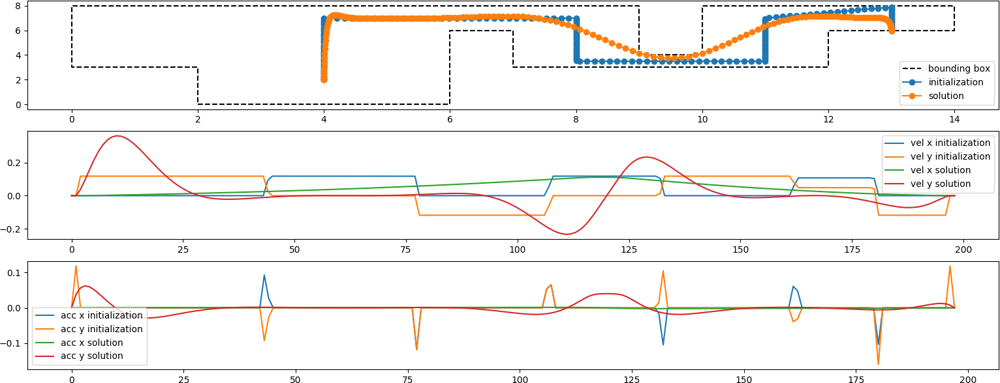

# FlightControl, a simple example of optimizing a trajectory with ceres

## Setup the build environment

I recommend `virtualenv` to set up a basic build environment while keeping your operating system clean. Install `ceres` following the instructions [here](http://ceres-solver.org/installation.html). Don't forget to add the install location to your `CPATH` resp. `LIBRARY_PATH` environment variables. If you use `virtualenv` you can add this to your `${VIRTUAL_ENV}/bin/activate` or `postactivate` script:

```
export CPATH=${VIRTUAL_ENV}/include
export LIBRARY_PATH=${LIBRARY_PATH}:${VIRTUAL_ENV}/lib
```

Now your linker should be able to locate the includes and the libraries. The `CMakeLists.txt` included in this repo is not too smart.

To use the `plot.py` script, you need `numpy` and `matplotlib` installed.

## Build and execute

* `$ cmake . && make`
* Now create some trajectories: `./flightcontrol`
* ... and see the plot: `python plot.py`

See `world.json` in this repository to find out about the problem configuration. It is a JSON format containing

* the weights for the optimizer (`weights`),
* the bounding polygon for the problem (`bounds`) and
* `rawInit`, which serves as an initial solution and at the same time determines start and destination (the first resp. last point of the array).

## A little bit of context

`FlightControl` optimizes a trajectory for an aircraft such as a helicopter. This is only a simplified 
example how `ceres` *could* be used to optimize such a trajectory.

The trajectory is optimized such that acceleration and jerk are minimized. This fosters trajectories which are perceived as comfortable and are convenient in terms of energy consumption. 

There are some assumptions to make the problem more interesting:

* The trajectory starts and ends in a zero dynamics state: velocity and acceleration are zero.
* The aircraft has to avoid certain areas. In the plot below the navigation area is outlined with a black, dashed line.
* The aircraft should fly at a desired height.

Simplifying assumptions:

* An initial trajectory satisfying the geometric constraints (stay inside the polygon) is given. This is needed because our optimizer is not good in finding out how to escape the contraints. Such an initial solution could be retrieved e.g. by a sparse graph search and the continuous optimizer is only used to refine the initial solution.
* The optimizer only tries to keep **points** of the trajectory inside the polygon. Of course there is a motion between two points, and the fact that even if two consecutive points are inside the polygon, the connecting line may not, is ignored here. However, this can be partly compensated by choosing a high number of samples.

